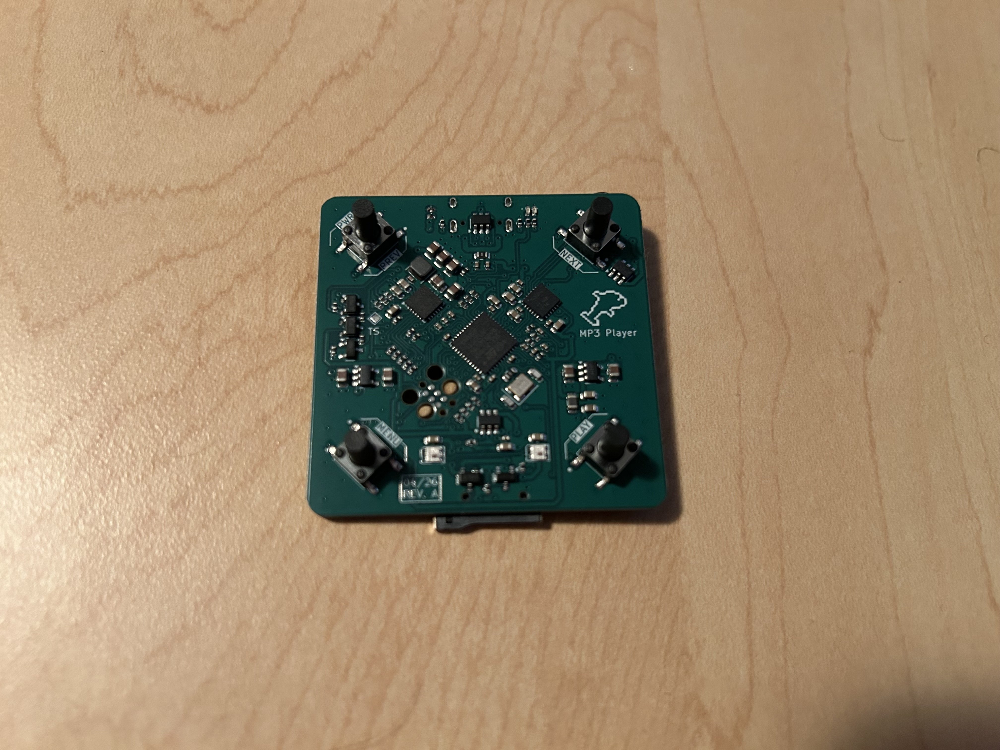
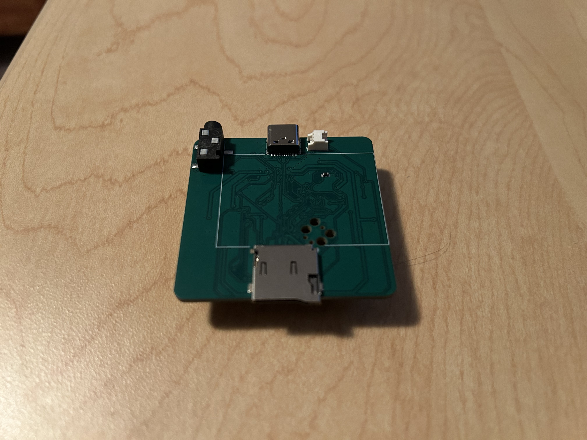

# MP3 Player

This is a simple MP3 player designed to be small, lightweight, and long-lasting. The goal is something I can bring on runs, hikes, or long trips that provides 24+ hours of music on a single charge with wired headphones. Firmware is currently in the works, with low level hardware drivers completed.

## Hardware

- **MCU**: STM32F411CEU6 (Cortex-M4F @ 100 MHz, USB OTG FS)
- **DAC**: TI TAD5242 stereo DAC over I²S, 3.5 mm headphone jack
- **Storage**: microSD card (SPI)
- **Power**: USB-C input, TI BQ24259 Li-ion charger, dual TPS7A20 LDOs for analog/digital rails
- **Controls**: 4 tactile switches (PWR, MENU, PLAY, NEXT), 2 × WS2812B-2020 RGB LEDs
- **PCB**: 4-layer, 50 × 50 mm, KiCad

## Repository layout

- `MP3-Player-PCB/` — KiCad project (schematics, board, libraries)
- `MP3-Player-PCB/Manufacturing/` — Gerbers, BOM, and pick-and-place files for JLCPCB
- `MP3-Player-Firmware/` — STM32CubeIDE project
- `images/` — Photos of the board
